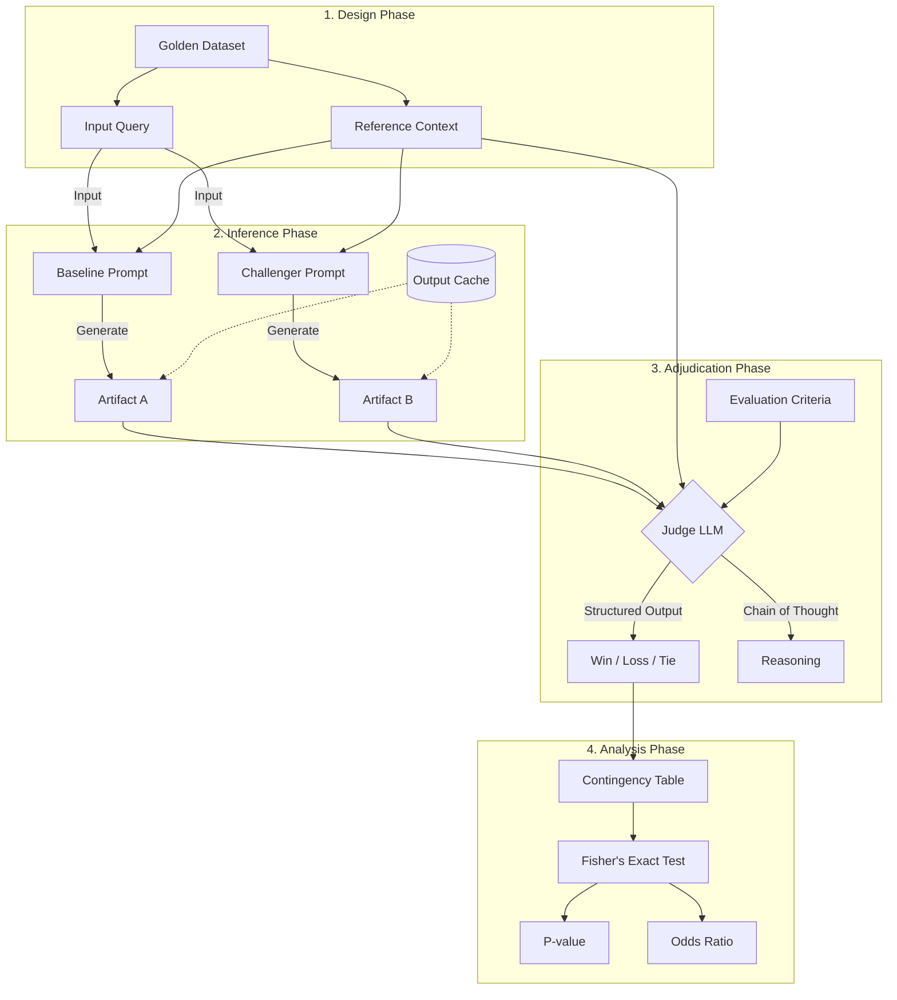

# LLM-as-a-Judge評価フレームワーク

このフレームワークは 生成AIの出力品質を**定量的かつ再現性を持って評価**するためのパイプライン  
主観的な「良さ」の判定を排し **統計的有意差に基づく意思決定**を目的とする

## 1. Experimental Design Strategy（評価設計フェーズ）

### Golden Datasetと比較対象の定義

 - **Ground Truth Definition（正解データの策定）**  
   - 評価の基準となる参照情報（Context）を確定する  

 - **Variable Control（変数の分離）**  
   - Baseline（現行の本番環境/標準プロンプト）  
   - Challenger（仮説に基づく改善案 例 精度向上など）  
   - *Note:* プロンプト以外の変数（Model temperature, Top-Pなど）は固定し 純粋なプロンプト効果のみを抽出する  

## 2. Inference Pipeline（推論実行フェーズ）

### 比較用アーティファクト（生成物）の効率的生成・管理

 - **Parallel Execution（並列生成）**  
   - BaselineとChallengerに同一入力（Query + Reference）を与え 非同期処理で出力を生成する  
 - **Idempotency & Caching（冪等性とキャッシュ）**  
   - コストとレイテンシ最小化のため 推論結果をハッシュキー（Input Hash）で永続化（SQLite/S3など）  
   - 再実行時はキャッシュ参照で再現性も確保する  

## 3. Adjudication Layer（自動評価フェーズ）

ここが「Judge」のコア機能で 2つの生成出力を**第三者視点で判定**する  

 - **Pairwise Comparison（ペアワイズ比較）**  
   - BaselineとChallenger出力を同時にJudgeモデルへ入力し どちらが優れているかを判定する  
   - Pointwise（単体評価）よりも相対的優劣判定の感度が高い  

 - **Structured Output（構造化出力）**  
   - 評価結果は自由記述ではなく 定義スキーマ（Pydantic/JSON Schemaなど）で出力する  
   - 指標例  
     - **正確性（Accuracy）**
     - **網羅性（Comprehensiveness）**
     - **整合性（Reliability）**
     - 各評価軸ごとに**Win/Loss/Tie**を決定  
   - **Reasoning:** 判定根拠を記述し ブラックボックス化を抑止する  

 - **Bias Mitigation（バイアス緩和）**  
   - **Position Bias対策:** LLMは先に提示された文章を好む傾向があるため 入力順序を入れ替えて2回（A vs B, B vs A）評価し 整合性を担保する  

## 4. Quantitative Significance Assessment（統計的検証フェーズ）

主観排除と **数学的な裏付け**のためのフェーズ

 - **Contingency Table Construction（分割表の作成）**  
   - 評価結果を2x2の分割表（Baseline Win/Loss vs Challenger Win/Loss）で集計する  

 - **Statistical Hypothesis Testing（統計的仮説検定）**  
   - **Fisher's Exact Test:** サンプルが小さい場合でも正確に確率計算する  
   - **P-value（P値）:** 帰無仮説を判定する 一般にp < 0.05で有意差あり  
   - **Odds Ratio（オッズ比）:** ChallengerがBaselineに対し何倍勝ちやすいか 1.0超で改善 下回れば改悪  

## Architecture Abstract

下記は 本フローのシステム図（Mermaid記法）

## Implementation Key Factors

本フレームワークを機能させるポイントは以下の3つ

1. **Separation of Concerns（関心の分離）:**  
   - 生成LLM（Generator）と評価LLM（Judge）を明確に分離し Judgeには高性能モデルを推奨  
2. **Schema Enforcement（スキーマの強制）:**  
   - 評価出力のゆらぎ防止のため Function CallingやJSON Modeで**必ずパース可能な形式**にする  
3. **Traceability（追跡可能性）:**  
   - 統計的に有意差なしと出た場合でも Judge出力のReasoning（理由）を参照し プロンプト改善のヒントを得る  
